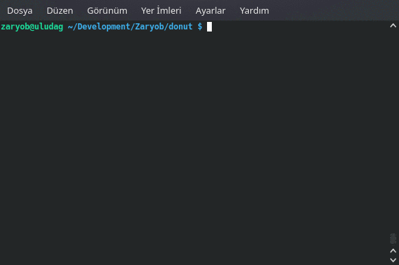

donut
-----

`Donut` is a 3D ascii-art project already made by [Andy Sloane](https://www.a1k0n.net/2011/07/20/donut-math.html)


To understand 3D donut and its algorithm in terms of Rust I gonna reinvent that stuff. :joy:

Just for enjoy :joy:

How to use it
-------------



```shell
    $ git clone https://github.com/Zaryob/donut
    $ cd donut
    $ cargo run
